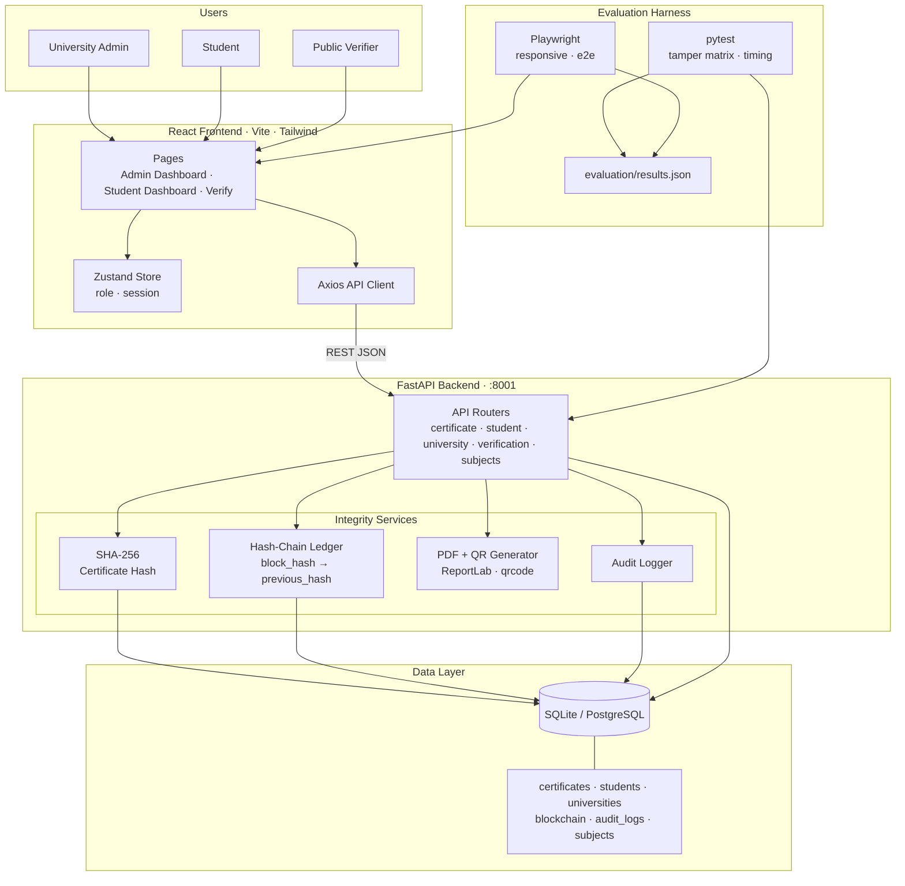
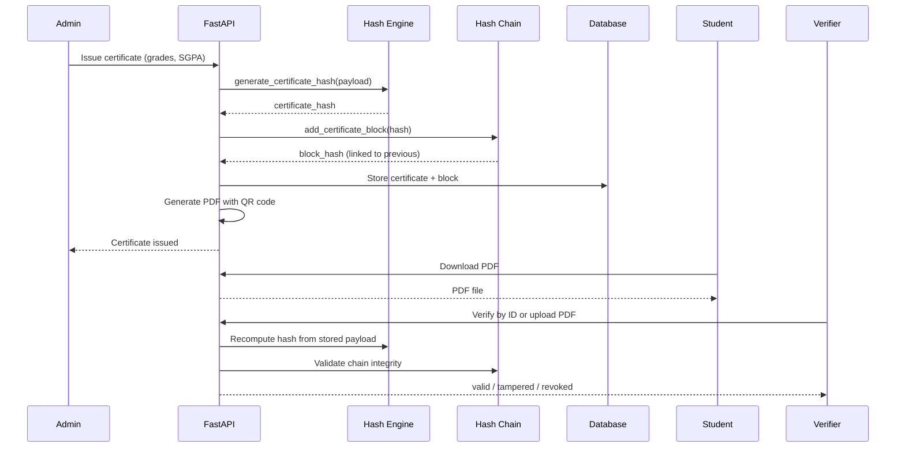

# CertChain

**Academic credential verification platform with hash-chain integrity.**

CertChain is a full-stack system for universities to issue semester grade-sheet certificates, students to view and download them, and anyone to verify authenticity — with tamper detection backed by a SHA-256 hash chain and audit logging.

> **Note:** This project uses a **simulated hash-chain ledger** stored in SQL (not Ethereum or smart contracts). Integrity is enforced through cryptographic hashing, chain validation, and PDF fingerprint checks.

---

## Features

- **University admin portal** — register, issue certificates, update/revoke, view audit logs
- **Student portal** — view certificates, download PDFs with embedded QR codes
- **Public verification** — verify by certificate ID or uploaded PDF
- **Hash-chain ledger** — each certificate block links to the previous via `block_hash`
- **Tamper detection** — payload hash mismatch flags altered grades, SGPA, or subject rows
- **PDF generation** — ReportLab certificates with QR codes linking to the verify endpoint
- **Research evaluation** — pytest + Playwright harness with quantified metrics

---

## Tech Stack

| Layer | Technologies |
|-------|-------------|
| **Backend** | Python, FastAPI, SQLAlchemy, Pydantic, Uvicorn |
| **Database** | SQLite (local) or PostgreSQL (Neon-ready) |
| **Frontend** | React 19, Vite, Tailwind CSS, Zustand, Framer Motion, Recharts |
| **PDF / QR** | ReportLab, qrcode, Pillow |
| **Testing** | pytest, Playwright |

---

## Architecture



### Certificate lifecycle



---

## Project Structure

```
CertChain/
├── backend/          # FastAPI API, models, hash-chain logic, PDF generation
├── frontend/         # React SPA (admin, student, public verify flows)
└── evaluation/       # Research metrics and evaluation scripts
```

---

## Getting Started

### Prerequisites

- **Python 3.10+**
- **Node.js 18+**
- *(Optional)* PostgreSQL connection string for production

### 1. Backend

```powershell
cd backend
python -m venv venv
.\venv\Scripts\Activate.ps1
pip install -r requirements.txt
```

By default the API uses **SQLite** (`certchain.db` in `backend/`). For PostgreSQL, copy `.env.example` to `.env` and set `CERTCHAIN_DATABASE_URL`.

Start the server:

```powershell
uvicorn app.main:app --reload --port 8001
```

API docs: [http://127.0.0.1:8001/docs](http://127.0.0.1:8001/docs)

### 2. Frontend

```powershell
cd frontend
npm install
npm run dev
```

The app expects the API at `http://127.0.0.1:8001` by default. Override with a `.env` file:

```
VITE_API_BASE_URL=http://127.0.0.1:8001
```

### 3. Run evaluation suite (optional)

```powershell
cd evaluation
.\run_all.ps1
```

Results are written to `evaluation/results.json`.

---

## Key API Endpoints

| Endpoint | Description |
|----------|-------------|
| `GET /certificate/verify/{id}` | Verify a certificate by ID |
| `GET /certificate/blockchain/integrity` | Validate the full hash chain |
| `POST /certificate/issue` | Issue a new certificate (admin) |
| `POST /certificate/revoke` | Revoke a certificate (admin) |

---

## Evaluation Highlights

From the bundled research evaluation (`evaluation/results.json`):

| Metric | Result |
|--------|--------|
| Hashed-field tamper detection | **100%** (7/7 cases) |
| Chain mutation detection | **100%** (integrity endpoint) |
| Median verification latency | **~8.7 ms** |
| Manual verification reference | ~45 min (configurable baseline) |

---

## User Roles

1. **Admin (University)** — register at `/admin-register`, issue and manage certificates
2. **Student** — register at `/register`, view and download certificates
3. **Public Verifier** — visit `/verify/{certificate-id}` or upload a PDF

---

## Environment Variables

| Variable | Default | Description |
|----------|---------|-------------|
| `CERTCHAIN_DATABASE_URL` | `sqlite:///./certchain.db` | Database connection string |
| `VITE_API_BASE_URL` | `http://127.0.0.1:8001` | Frontend API base URL |

See `backend/.env.example` for PostgreSQL (Neon) setup.

---

## Author

**Abhinav** — [GitHub @Abhinav2324-tech](https://github.com/Abhinav2324-tech)

---

## License

This project is for academic and portfolio purposes.
